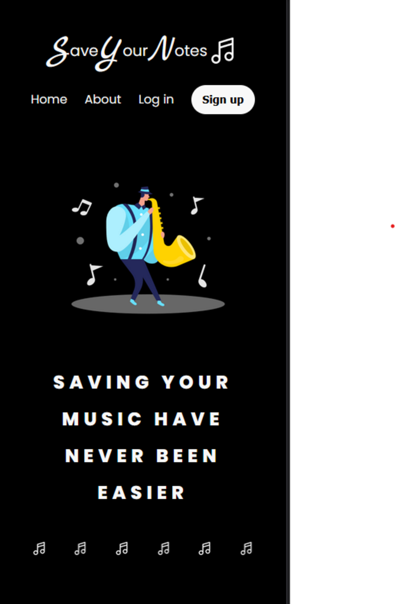
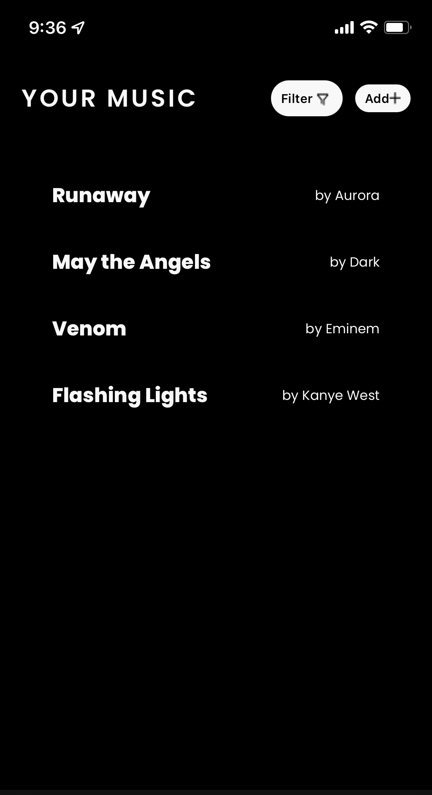
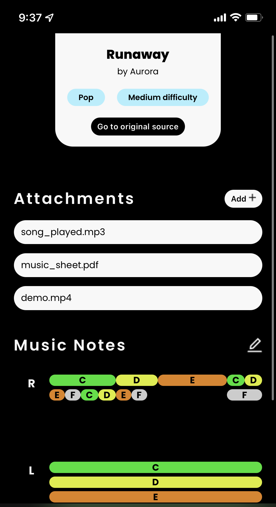

# SaveYourNotes Web App
## Working on:
* Converting the plain HTML files into React components
* convert sass code to React code using styled-components module
* working on resizing music notes by dragging

## Current state of the app

    

        <h3>Home</h3>
        
    

    

        <h3>Your Music</h3>
        
    

    

        <h3>Music</h3>
        
    

